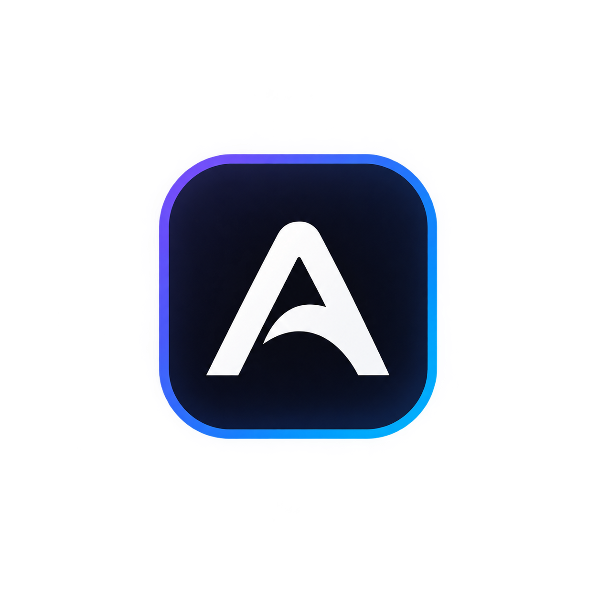

<div align="center">
  
  <h1>Aarush Khandelwal — Portfolio</h1>
  <p>A personal portfolio website where I showcase my projects, technical skills, internships, coding profiles, and the things I'm currently building and learning.</p>
  <p>
    <a href="https://aarush-portfolio-six.vercel.app/"><strong>🌐 Live Website</strong></a> ·
    <a href="https://github.com/Aarush005coder">GitHub</a> ·
    <a href="https://www.linkedin.com/in/aarush-khandelwal-1b99a7320/">LinkedIn</a>
  </p>
</div>

The goal of this portfolio is to keep my work simple, clear, and easy to explore, while giving more focus to the actual projects and experience behind my work.

---

## ✨ Features

- Responsive design for desktop, tablet, and mobile
- Clean and minimal user interface
- Personal introduction and professional profile
- Selected projects and technical work
- Internship and experience section
- Technical skills and technologies
- Coding platforms and developer profiles
- Certificates and achievements
- Links to GitHub, LinkedIn, and other profiles
- Smooth animations and interactions
- Dark mode toggle
- Easy navigation between sections

---

## 🛠️ Built With

- **React** — Building the user interface
- **Vite** — Development and production build
- **JavaScript** — Logic and interactions
- **HTML5** — Structure
- **CSS3** — Styling, layout, responsiveness, and animations

---

## 📁 Project Structure

```text
aarush-portfolio/
├── public/
│   ├── images/certs/        # certificate scans
│   ├── my_portfolio_logo.png
│   └── og-banner.png
├── src/
│   ├── assets/project-images/   # project screenshots (bundled by Vite)
│   ├── components/
│   │   ├── layout/              # navbar, footer
│   │   ├── sections/            # one file per section
│   │   ├── ui/                  # buttons, cards, chips
│   │   └── mockup/              # 3D tilted project cards
│   ├── data/portfolio.js        # all content lives here
│   ├── styles/index.css         # all styling + dark mode tokens
│   ├── App.jsx
│   ├── main.jsx
│   └── index.css
├── index.html
├── package.json
├── vite.config.js
└── README.md
```

---

## 🚀 Run Locally

Clone the repository:

```bash
git clone https://github.com/Aarush005coder/aarush-portfolio.git
```

Go to the project directory:

```bash
cd aarush-portfolio
```

Install the dependencies:

```bash
npm install
```

Start the development server:

```bash
npm run dev
```

Open the local URL shown in the terminal to view the portfolio.

---

## 📦 Production Build

Create a production build:

```bash
npm run build
```

Preview the production build:

```bash
npm run preview
```

---

## 📌 What You'll Find Here

- Software engineering projects
- AI/ML and computer vision projects
- Data and analytics work
- DSA and problem-solving practice
- Internship experience
- Technical skills
- Coding profiles
- Certificates and achievements

---

## 👨‍💻 About Me

I'm a 3rd-year Artificial Intelligence & Data Science student interested in software engineering, AI/ML, data, and building practical products.

I enjoy solving problems, learning new technologies, and turning ideas into working applications. My projects range from software and web development to machine learning, computer vision, and data-driven applications.

---

## 📫 Connect With Me

<div align="center">

<a href="https://github.com/Aarush005coder">
  
</a>
&nbsp;&nbsp;&nbsp;&nbsp;

<a href="https://www.linkedin.com/in/aarush-khandelwal-1b99a7320/">
  
</a>
&nbsp;&nbsp;&nbsp;&nbsp;

<a href="mailto:khandelwalaarush2@gmail.com">
  
</a>
&nbsp;&nbsp;&nbsp;&nbsp;

<a href="https://aarush-portfolio-six.vercel.app/">
